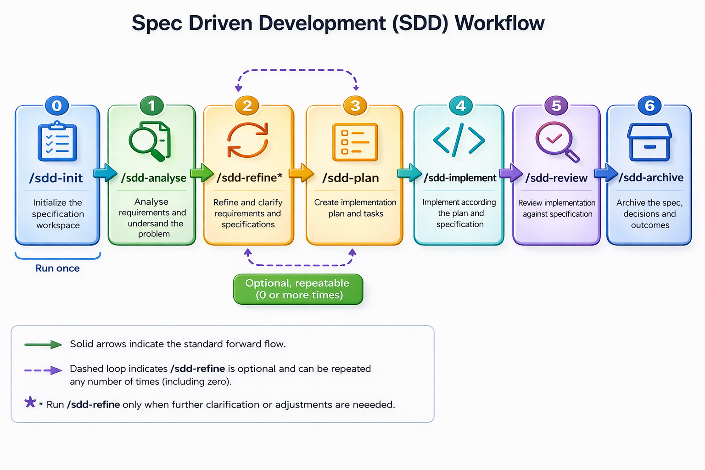

# SDD Skills for AI Agents

A set of Agent Skills that automate **Spec Driven Development (SDD)** — a structured workflow for taking a feature from raw idea to reviewed, archived implementation using AI at every step.

## What is Spec Driven Development?

SDD is a disciplined AI-assisted development workflow where every feature starts with a written specification, proceeds through an explicit implementation plan, and is only closed out after a code review and archival. Nothing gets built without a spec. Nothing gets shipped without a review.

This prevents the common failure mode of AI-assisted development: jumping straight to code from a vague prompt, producing something that half-works and can't be maintained.

## SDD Workflow

```
/sdd-init  →  /sdd-analyse  →  /sdd-refine*  →  /sdd-plan  →  /sdd-implement  →  /sdd-review  →  /sdd-archive
(once)                          (optional,
                                repeatable)
```



Each skill picks up where the previous one left off using the files produced along the way (`feature.md`, `plan.md`).
At any point you can inspect or manually edit these files before continuing.

### Fast path

```
/sdd-init  →  /sdd-yolo <feature description>
(once)
```

`/sdd-yolo` runs the full pipeline — analyse → plan → implement → review → archive — with a single confirmation gate before implementation begins. It stops automatically if Critical or Major issues are found in the review.

---

## Who is this for?

This SDD workflow is useful across different working contexts. The workflow covers **feature development only** — from idea to reviewed, archived code. Deployment is out of scope.

**Solo developers and indie hackers** working on SaaS products typically own both the requirements and the code. They can use the full pipeline end-to-end: `/sdd-analyse` to turn an idea into a spec, `/sdd-plan` to produce an implementation plan, and `/sdd-implement` through `/sdd-archive` to ship and document it.

**Enterprise teams** usually separate requirements from implementation. A Business Analyst talking to stakeholders can use `/sdd-analyse` and `/sdd-refine` to produce a structured, unambiguous `feature.md` spec — then hand it to the development team, who pick up from `/sdd-plan` onwards.

In both cases, the structured spec in `feature.md` is the handoff artifact. The earlier in the workflow you invest in it, the less rework happens downstream.

**NOTE:** 
**A spec is not a complete, final contract.** It captures what is known at the time it is written. Requirements evolve — new edge cases surface during implementation, stakeholders refine their thinking, and constraints change. When that happens, use `/sdd-refine` to update the current spec, or start a new `/sdd-analyse` cycle for the follow-on work. The goal is not a perfect upfront specification; it is a shared, written understanding that keeps the team aligned as understanding grows.

---

## Prerequisites

- [Claude Code](https://claude.ai/code) or [Codex](https://openai.com/codex/) installed and running in your project
- A `docs/project.md` file at the root of your project describing your tech stack, architecture, and conventions (the skills read this file to tailor their output — the richer it is, the better the results)

> **New project?** Run `/sdd-init` after installation — it analyses your codebase and generates `docs/project.md` for you.

## Installation

```bash
npx skills add https://github.com/sivaprasadreddy/sdd-skills
```

### Verify installation
Start your AI Agent in your project and run:
```
/sdd-init
```
If AI Agent begins analysing your project structure, the skills are installed correctly.

---

## How to use?

Here is a complete end-to-end example of adding JWT authentication to a Spring Boot project.

### Step 0 — Initialize project context (once per project)

```
/sdd-init
```

AI Agent scans your build files and source tree, asks for your project name, mission, and any conventions it couldn't detect, then writes `docs/project.md`. Review it and correct anything that looks wrong.

---

### Step 1 — Analyse the feature

```
/sdd-analyse Add JWT-based authentication with refresh token support
```

AI Agent reads `docs/project.md`, asks up to 5 clarifying questions (token expiry times, refresh strategy, endpoints to protect, etc.), then writes `feature.md` with structured user stories, functional requirements (FR-01, FR-02, …), acceptance criteria (AC-01, AC-02, …), and out-of-scope boundaries. Review the spec before continuing.

---

### Step 2 — Refine if needed _(optional, repeatable)_

```
/sdd-refine Add rate limiting — max 5 failed login attempts per minute
```

AI Agent shows a diff of the proposed changes to `feature.md` and asks for confirmation before applying them. If `plan.md` already exists it tells you which steps are now stale. Repeat as many times as needed before planning.

---

### Step 3 — Plan the implementation

```
/sdd-plan
```

AI Agent reads `feature.md` and `docs/project.md`, identifies your exact stack and architecture pattern, then writes `plan.md` as ordered implementation steps (migration → domain → service → controller → tests), each with specific file paths and checklist items. It also maps every AC to the test method that will verify it. Approve the plan before implementing.

---

### Step 4 — Implement

```
/sdd-implement
```

AI Agent works through `plan.md` step by step, reads existing code first to match your conventions, compiles after each layer, runs tests after writing them, and fixes any failures before moving on. It will not introduce new dependencies without flagging them to you. When done it reports pass/fail for every AC.

---

### Step 5 — Review

```
/sdd-review
```

AI Agent reviews all files changed in this branch across 8 dimensions (AC coverage, Java/Spring best practices, security, duplication, design, performance, test quality, observability). Every finding cites the exact file and line range with a severity level. The review ends with an explicit merge verdict. You can ask AI Agent to fix Critical and Major findings immediately.

---

### Step 6 — Archive

```
/sdd-archive 
/sdd-archive jwt-authentication (explicit feature name)
```

AI Agent verifies all AC checkboxes are ticked, moves `feature.md` and `plan.md` into `docs/specs-archive/jwt-authentication/`, and creates a brief `README.md` there summarising what was built and any notable decisions. Commit the archive directory — it is your project's institutional memory.

---

### Fast path — Steps 1–6 in one command

If you want to skip the individual step commands and ship in one shot, use `/sdd-yolo` instead:

```
/sdd-yolo Add JWT-based authentication with refresh token support
```

AI Agent runs analyse → plan → implement → review → archive automatically. It pauses once for your confirmation before writing any code, then runs the full pipeline unattended. If the review finds Critical or Major issues it stops and reports rather than archiving.

---

## Skills Reference

### `/sdd-init` — Project Initialisation

**Purpose:** Analyses the project codebase and generates `docs/project.md` — the context file that all other SDD skills depend on. Run once when setting up SDD in a new project.

**Usage:**
```
/sdd-init
```

**What it does:**
1. Checks whether `docs/project.md` already exists — if so, asks for confirmation before overwriting
2. Scans build files (`pom.xml`, `build.gradle`, `package.json`, `docker-compose.yml`, etc.) to auto-detect language, framework, build tool, database, ORM, migration tool, messaging, and testing libraries
3. Explores the source tree to infer the architecture pattern (Layered, Hexagonal, Modular Monolith, etc.) and package conventions
4. Asks the user for information that cannot be detected: project mission, any conventions not visible in the code, and approved-dependency constraints
5. Writes `docs/project.md` with all fields populated — no placeholder text left behind
6. Confirms what was auto-detected vs. what the user provided, and prompts a review before starting feature work

**Input:** None
**Output:** `docs/project.md`
**Requires:** Nothing — this is the starting point

---

### `/sdd-analyse` — Feature Analysis

**Purpose:** Turns a raw feature idea into a structured, unambiguous `feature.md` specification.

**Usage:**
```
/sdd-analyse Add JWT-based authentication with refresh token support
/sdd-analyse                          # prompts interactively if no argument given
```

**What it does:**
1. Reads `docs/project.md` to understand your tech stack and constraints
2. Analyses the request across 7 dimensions: functional requirements, user stories, acceptance criteria, edge cases, integration points, non-functional requirements, and out-of-scope boundaries
3. Asks up to 5 clarifying questions if critical information is missing — it will not write a spec from a vague prompt
4. Produces `feature.md` in the project root with a standardised structure covering summary, user stories, functional requirements (FR-01, FR-02, ...), acceptance criteria (AC-01, AC-02, ...), technical scope, NFRs, out-of-scope items, and open questions
5. Summarises the spec and asks you to review before you proceed

**Input:** Feature description as argument (or interactive)
**Output:** `feature.md` in project root
**Requires:** `docs/project.md`

---

### `/sdd-refine` — Spec Refinement

**Purpose:** Updates or enhances an existing `feature.md` when requirements change, new edge cases are discovered, or the spec needs clarification. Can be run multiple times.

**Usage:**
```
/sdd-refine Add rate limiting — max 5 login attempts per minute
/sdd-refine                    # asks what to change interactively
```

**What it does:**
1. Reads the current `feature.md`, `docs/project.md`, and `plan.md` (if it exists)
2. Understands the refinement request and identifies which sections are affected
3. Asks up to 3 clarifying questions if the request is ambiguous
4. Shows a diff summary of proposed additions, modifications, and removals — and asks for your confirmation before touching the file
5. Applies the changes, preserving existing structure and any completed AC checkboxes
6. If `plan.md` already exists, produces an impact assessment identifying which plan steps are now stale and recommending whether to re-run `/sdd-plan`
7. Appends an entry to a revision history table at the bottom of `feature.md`

**Input:** Change description as argument (or interactive)
**Output:** Updated `feature.md` with revision history entry; impact assessment on `plan.md` if applicable
**Requires:** `feature.md` (run `/sdd-analyse` first if it doesn't exist)

---

### `/sdd-plan` — Implementation Planning

**Purpose:** Reads `feature.md` and produces a detailed, tech-stack-aware `plan.md` with step-by-step implementation tasks.

**Usage:**
```
/sdd-plan
```

**What it does:**
1. Reads `feature.md` and `docs/project.md` in full before producing anything
2. Identifies the exact tech stack: language, framework, build tool, database/ORM, messaging, testing libraries, and architecture pattern (Layered, Hexagonal, DDD, etc.)
3. Produces `plan.md` structured as ordered implementation steps — typically: schema/migration → domain layer → service layer → infrastructure/adapters → API/presentation layer → tests
4. Each step contains specific file paths to create or modify and checklist items
5. Includes an acceptance criteria mapping table linking each AC from `feature.md` to the specific test method that will verify it
6. Notes risks and mitigations, and provides a complexity estimate
7. Presents a summary and asks for your approval before you proceed to implementation

**Input:** None (reads `feature.md` automatically)
**Output:** `plan.md` in project root
**Requires:** `feature.md`, `docs/project.md`

---

### `/sdd-implement` — Implementation

**Purpose:** Executes the implementation plan step by step, compiling and running tests after each layer, and verifies all acceptance criteria before declaring the feature done.

**Usage:**
```
/sdd-implement
```

**What it does:**
1. Reads `plan.md`, `feature.md`, and `docs/project.md` before writing any code
2. Reads existing similar files in the codebase to understand conventions before creating new ones
3. Executes each step in `plan.md` in order, announcing each step as it starts
4. Runs verification after each layer: compiles after adding new classes, runs tests after writing them, and checks migrations apply cleanly
5. Fixes any compiler errors or test failures before moving to the next step — never carries failures forward
6. **Marks each step as complete in `plan.md`** (`- [ ]` → `- [x]`) as soon as it is verified
7. Does not introduce new dependencies without flagging them to you first
8. After all steps, runs the full test suite and checks every AC from `feature.md` against a passing test
9. Writes `impl-summary.md` with concise bullet-point entries for files created/modified, AC pass/fail status, and any notable deviations
10. Prompts you to run `/sdd-review` next

**Input:** None (reads `plan.md` automatically)
**Output:** Implemented feature code with passing tests; `impl-summary.md` in project root
**Requires:** `plan.md`, `feature.md`, `docs/project.md`

---

### `/sdd-review` — Code Review

**Purpose:** Conducts a thorough, opinionated code review across 8 dimensions — language best practices, framework conventions, security, duplication, design, performance, test quality, and observability — and produces a structured report with a clear merge verdict.

**Usage:**
```
/sdd-review                                      # reviews all files changed in this branch
/sdd-review src/main/java/com/example/auth/      # reviews a specific package
/sdd-review src/main/java/com/example/UserService.java  # reviews a single file
```

**What it does:**
1. Reads `docs/project.md`, `feature.md`, and `plan.md` to understand intent and conventions
2. Determines scope: if no argument given, runs `git diff main...HEAD --name-only` and focuses the review on changed files only (not the entire codebase)
3. For each AC that is fully covered and satisfied, **marks it as complete in `feature.md`** (`- [ ]` → `- [x]`); flags any uncovered AC as 🔴 Critical
4. Reviews across 8 dimensions, with every finding citing the exact file and line range:

   | Dimension                   | What's checked                                                                                                                                 |
   |-----------------------------|------------------------------------------------------------------------------------------------------------------------------------------------|
   | **AC Verification**         | Every acceptance criterion has a test that covers it                                                                                           |
   | **Java best practices**     | Modern Java features, Optional usage, streams, immutability, no swallowed exceptions                                                           |
   | **Spring Boot conventions** | Constructor injection, `@Transactional` placement, no logic in controllers, `@ConfigurationProperties`, correct HTTP status codes, slice tests |
   | **Spring Data JPA**         | Pagination on queries, N+1 risks, JPQL vs native SQL, safe Optional unwrapping                                                                 |
   | **Security**                | Injection risks, authorisation on endpoints, Bean Validation, no secrets in logs/responses, mass assignment, CORS/CSRF                         |
   | **Code duplication**        | Logic duplicated from existing utilities, copy-paste between tests, repeated conditionals that should be polymorphism                          |
   | **Design & architecture**   | Layer boundary violations, Single Responsibility, package structure consistency                                                                |
   | **Performance**             | Queries in loops, missing pagination, expensive operations in hot paths                                                                        |
   | **Test quality**            | AAA structure, descriptive names, no logic in tests, correct mock boundaries, no `Thread.sleep()`                                              |
   | **Observability**           | Log levels, no sensitive data in logs, Micrometer instrumentation                                                                              |

5. Assigns severity to every finding: 🔴 Critical / 🟠 Major / 🟡 Minor / 🔵 Info
6. Produces a structured report with an AC coverage table and an explicit merge verdict
7. Offers to fix Critical and Major findings immediately if you ask

**Input:** Optional path argument (defaults to git diff scope)
**Output:** `review.md` with merge verdict; `feature.md` updated with verified AC checkboxes ticked
**Requires:** `docs/project.md` (feature.md and plan.md used if present)

**Review verdict levels:**

| Verdict                         | Meaning                                   |
|---------------------------------|-------------------------------------------|
| ✅ Ready to merge                | No significant issues found               |
| 🟡 Merge after minor fixes      | Small issues, no re-review needed         |
| 🟠 Requires fixes and re-review | Substantive issues that need another pass |
| 🔴 Do not merge                 | Critical or security issues present       |

---

### `/sdd-archive` — Archive

**Purpose:** Moves `feature.md`, `plan.md`, and `impl-summary.md` into a permanent `docs/specs-archive/<feature-name>/` directory once the feature is complete and reviewed, keeping the project root clean.

**Usage:**
```
/sdd-archive                        # derives folder name from feature.md heading
/sdd-archive jwt-authentication     # explicit folder name
```

**What it does:**
1. Determines the archive folder name — from your argument (kebab-case) or derived from the `# Feature:` heading in `feature.md`
2. Checks that all AC checkboxes in `feature.md` are ticked — warns you and asks for confirmation if any are unchecked
3. Updates `docs/project.md` with: the new feature entry, any architectural decisions made, new API endpoints, and new environment/configuration keys introduced by the feature
4. Shows a summary of every proposed change to `project.md` and asks for your confirmation before writing
5. Moves `feature.md`, `plan.md`, and `impl-summary.md` (if present) into `docs/specs-archive/<feature-name>/`
6. Creates `docs/specs-archive/<feature-name>/README.md` with a brief summary of what was built, key files, and notable decisions
7. Reminds you to commit the `docs/specs-archive/<feature-name>/` directory and `docs/project.md` to version control

**Input:** Optional feature name argument
**Output:** `docs/specs-archive/<feature-name>/feature.md`, `plan.md`, `impl-summary.md` (if present), `README.md`
**Requires:** `feature.md`, `plan.md` in project root

---

### `/sdd-yolo` — Full Pipeline (Fast Path)

**Purpose:** Runs the complete SDD pipeline — analyse → plan → implement → review → archive — with a single confirmation gate before implementation. Use when you want to ship a well-understood feature with minimal interruptions.

**Usage:**
```
/sdd-yolo Add JWT-based authentication with refresh token support
```

**What it does:**
1. Analyses the feature request and writes `feature.md` (asks only blocker-level clarifying questions, max 3)
2. Reads `feature.md` and writes `plan.md` immediately
3. Presents a compact spec + plan summary and waits for **one confirmation** (`PROCEED`) before writing any code
4. Implements the full plan, compiling and running tests after each layer — stops if any AC is failing
5. Runs the full code review across all 8 dimensions
6. **If verdict is ✅ Ready to merge or 🟡 Merge after minor fixes:** runs `/sdd-archive` automatically
7. **If verdict is 🟠 Requires fixes or 🔴 Do not merge:** stops and reports — leaves `feature.md` and `plan.md` in place for manual continuation

**Input:** Feature description as argument (required)
**Output:** Fully implemented, reviewed, and archived feature — or a stopped pipeline with a clear report
**Requires:** `docs/project.md` (run `/sdd-init` first if it doesn't exist)

---

## Project Structure

After running the full workflow for a feature, your project will look like this:

```
your-project/
├── docs/
│   ├── project.md                  ← always-on project context (you maintain this)
│   └── specs-archive/              ← archived after /sdd-archive
│       └── jwt-authentication/     ← archived after /sdd-archive
│           ├── feature.md
│           ├── plan.md
│           ├── impl-summary.md     ← present if /sdd-implement was used
│           └── README.md
├── .claude/
│   └── skills/
│       ├── sdd-init/
│       │   └── SKILL.md
│       ├── sdd-analyse/
│       │   └── SKILL.md
│       ├── sdd-plan/
│       │   └── SKILL.md
│       ├── sdd-implement/
│       │   └── SKILL.md
│       ├── sdd-refine/
│       │   └── SKILL.md
│       ├── sdd-review/
│       │   └── SKILL.md
│       └── sdd-archive/
│           └── SKILL.md
├── CLAUDE.md                       ← always-on context for Claude (see below)
├── AGENTS.md                       ← always-on context for AI Agents(Codex, Gemini, etc)
├── feature.md                      ← active feature spec (exists during development only)
├── plan.md                         ← active implementation plan (exists during development only)
└── src/
    └── ...
```

---

## Recommended CLAUDE.md or AGENTS.md

Create a `CLAUDE.md`/`AGENTS.md` at your project root. AI Agent loads this automatically at the start of every session:

```markdown
# Project Context

Read `docs/project.md` for mission, tech stack, and architecture before making any decisions.

## SDD Workflow
This project uses Spec Driven Development. The workflow is:
1. `/sdd-init` → analyses the codebase and produces `docs/project.md` (run once per project)
2. `/sdd-analyse <feature description>` → produces `feature.md`
3. `/sdd-refine <change>` → updates `feature.md` (optional, repeatable)
4. `/sdd-plan` → reads `feature.md`, produces `plan.md`
5. `/sdd-implement` → reads `plan.md`, implements and verifies
6. `/sdd-review` → reviews code quality, security, and AC coverage
7. `/sdd-archive` → archives `feature.md`, `plan.md`, and `impl-summary.md` to `docs/specs-archive/<feature-name>/`

Never skip steps. Always read `docs/project.md` before planning or implementing.
```

---

## Recommended `docs/project.md` Structure

The skills rely heavily on this file. Include at minimum:

```markdown
# Project: <Name>

## Mission
<One paragraph on what this application does and who it serves.>

## Tech Stack
- Language: Java 25
- Framework: Spring Boot 4.x
- Build tool: Maven
- Database: PostgreSQL 18
- ORM: Spring Data JPA / Hibernate
- Migrations: Flyway
- Messaging: (e.g., Apache Kafka, RabbitMQ, or none)
- Testing: JUnit 5, Mockito, Testcontainers, RestAssured
- Other: Spring Security, MapStruct, Lombok

## Architecture
<Describe your pattern: Layered / Hexagonal / DDD / Modular Monolith / Microservices>
<Include package structure conventions.>

## Conventions
- Package naming: com.example.<module>.<layer>
- REST base path: /api/v1
- Error handling: GlobalExceptionHandler via @RestControllerAdvice
- All endpoints require authentication unless annotated @Public
- <Any other conventions AI Agent should follow>

## Approved Dependencies
<List libraries already approved for use. Anything outside this list requires a flag.>
```

---

## Tips

**Start every session with context.** If you are picking up work mid-feature, tell AI Agent: *"I'm continuing work on the JWT authentication feature. `feature.md` and `plan.md` are in the root."* AI Agent does not retain memory between sessions.

**Refine before you plan.** If you think of new requirements after running `/sdd-analyse` but before `/sdd-plan`, use `/sdd-refine` — it is cheaper to update a spec than to re-plan or re-implement.

**Re-plan after significant refinements.** If `/sdd-refine` reports that multiple plan steps are invalidated, run `/sdd-plan` again rather than manually patching `plan.md`.

**Use the path argument for focused reviews.** If you made a small change after the initial review, run `/sdd-review src/path/to/ChangedFile.java` rather than re-reviewing the whole diff.

**Commit `docs/` to version control.** The archived `docs/specs-archive/<feature-name>/` directories are your project's institutional memory — they explain why the code is the way it is, which is invaluable for onboarding and debugging months later.

**Keep `docs/project.md` up to date.** Every time you adopt a new library, change your architecture, or establish a new convention, update this file. It is the single most important input to the planning and review skills.
